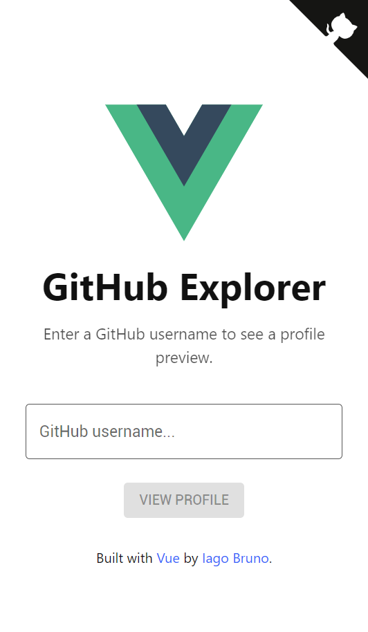
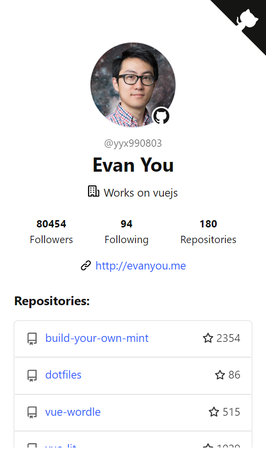
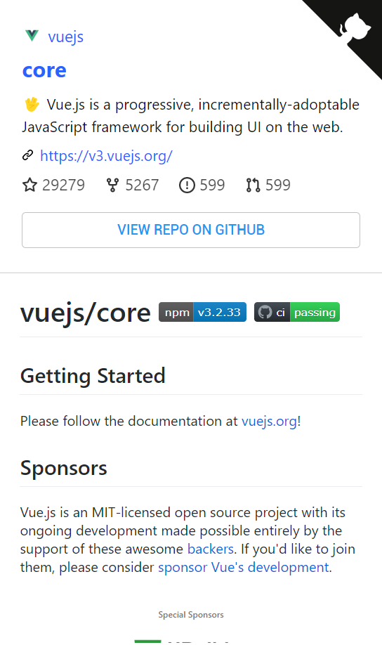

# simple-vue-app

[](https://simple-vue-app-iagobruno.vercel.app/)

|  |  |  |
| ----------------------------- | -------------------------------- | ----------------------------- |

## Getting started

```bash
> git clone https://github.com/iagobruno/simple-vue-app
> cd simple-vue-app
> yarn install
> yarn run dev
```

And then open [localhost:3000](http://localhost:3000) in your browser.

By default, the server will only respond to requests from localhost. To allow connections from other computers, edit the sirv commands in package.json to include the option --host 0.0.0.0.

If you're using Visual Studio Code we recommend installing the official extension [Volar](https://marketplace.visualstudio.com/items?itemName=johnsoncodehk.volar) (and disable Vetur) + [TypeScript Vue Plugin (Volar)](https://marketplace.visualstudio.com/items?itemName=johnsoncodehk.vscode-typescript-vue-plugin).

## Building

To create an optimised version of the app:

```bash
> yarn run build
```

You can now deploy the `dist` folder to any cdn like Netlify or Vercel.
